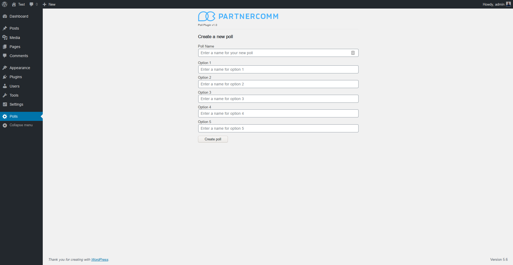

# Wordpress poll plugin

This is a small plugin developed as a code challenge for a job application. It adds the capability to build polls within the Wordpress admin area and enables REST routes to cast votes.



## How to use:

[Download the latest release](https://github.com/ThatJohn/pc-wp-polls/releases/tag/v1.0) and install via the plugin manager. After installation, a new "Polls" menu will be available. Click on it to be taken to the poll creation screen.

Three new REST endpoints will now be available:

-   GET all polls from `http://example.com/wp-json/partnercomm/polls`
-   GET one poll by ID from `http://example.com/wp-json/partnercomm/polls/:id`
-   POST cast vote to `http://example.com/wp-json/partnercomm/polls`

Sample POST request body:

```
{
    "poll_id": 1,
    "option_id": 2
}
```

-   Finally, go to the [frontend repo](https://github.com/ThatJohn/wp-polls-frontend) for a small Vue app to consume these endpoints.

## TODO:

-   Create route to get all polls. ✅
-   Create route to get single poll. ✅
-   Create route to cast votes. ✅
-   Create additional routes to allow for poll creation via API requests. 🚧
-   Improve admin interface to view more information about polls and options. 🚧
